# Portfolio

## Git-hub repo 
Open [GitHub](https://github.com/Sam559I/Portfolio)
- 
## Purpose
 The portfolio website serves as a platform to exhibit my skills and attributes to both my peers and potential employers, while also functioning as a promotional tool to showcase the skills utilized in its creation to prospective clients. 

Through this website, I aim to present a  overview of my capabilities in a visually engaging and professional manner. It will feature sections such as an About Me page, Portfolio highlighting my work, Resume/CV section, blog and contact page.

## Functionality / features
- 
## Site map
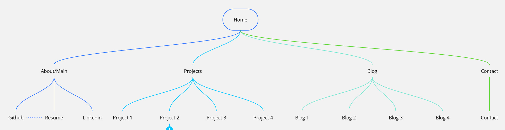
Very simple design for website site map with easy features.
1. Home
- Quick access to Resume, LinkedIn, and GitHub profiles
- Introduction about myself
- Proficiency in programming highlighted in the Skills section
2. Projects
-Brief overview of 4 projects
3. Blog
- Simple design with 4 blog posts 
4. Contact
- Easy-to-use contact form

## Target audience
- Potential Employers: These could be recruiters, hiring managers, or HR professionals in my industry who are looking to assess my  skills, experience, and suitability for job opportunities.

- Peers and Colleagues: Other professionals in my field who may be interested in collaborating me, networking etc.

- Clients or Potential Clients: My portfolio website can serve as a showcase for potential clients who are considering hiring for my services

## Tech stack
1. HTML
2. CSS
3. git
4. github

## Wireframe
open [figma](https://www.figma.com/file/UGwWoGLfsIBdnsMtpguGNc/Untitled?type=whiteboard&node-id=0-1&t=TsFUi8y45Unmmbtd-0)
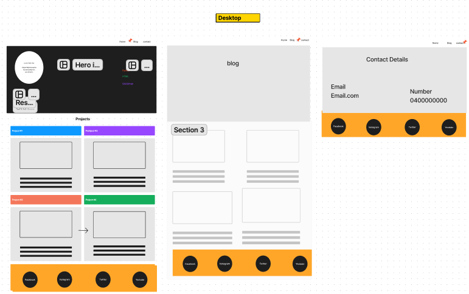
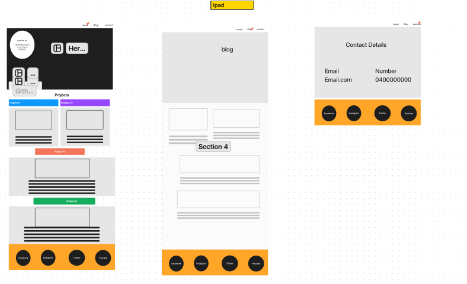
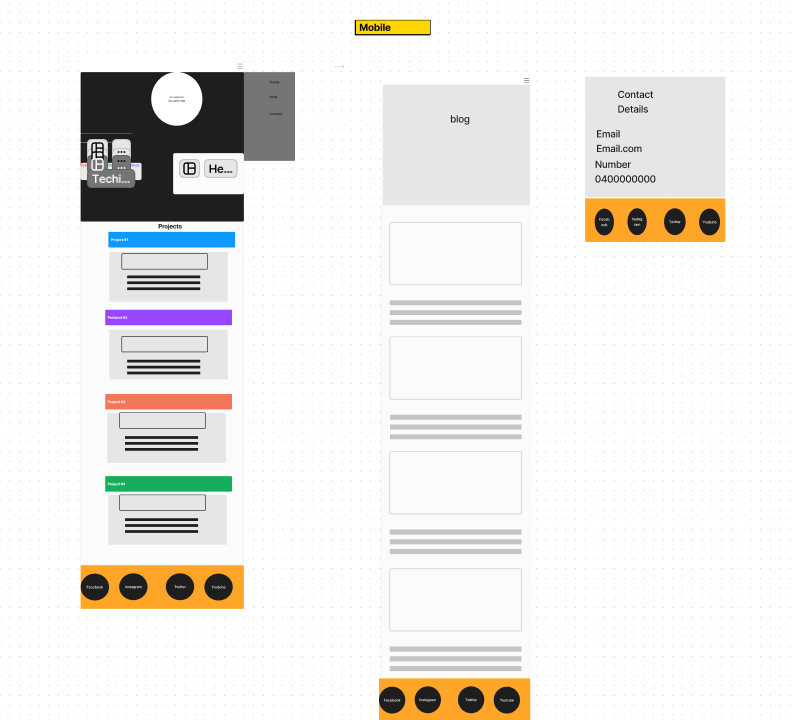

Final version slightly modified from original design for better functionality and overall better finished product.

## Screnshots
### Desktop
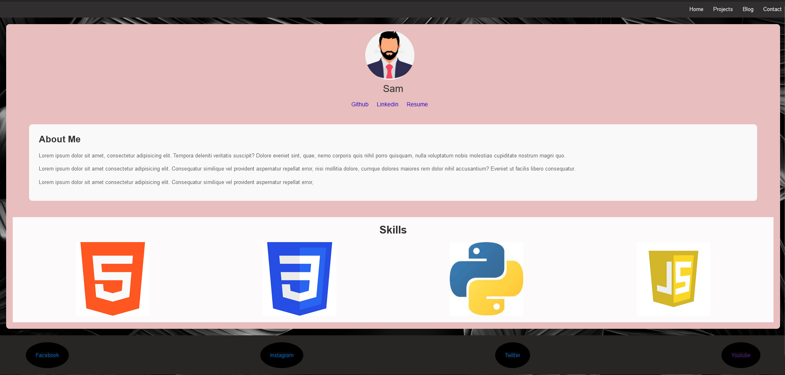

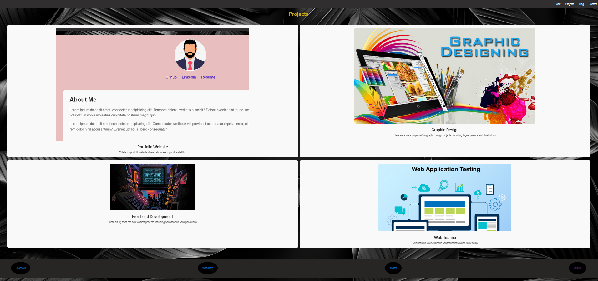

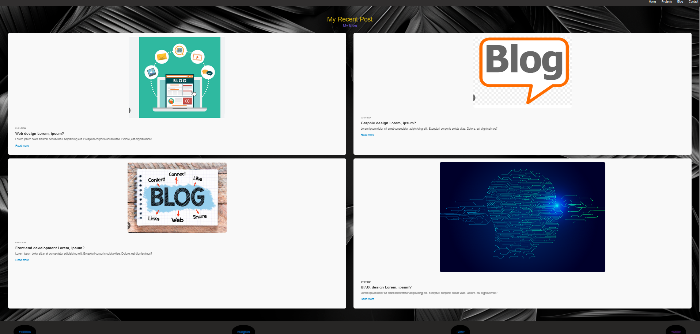

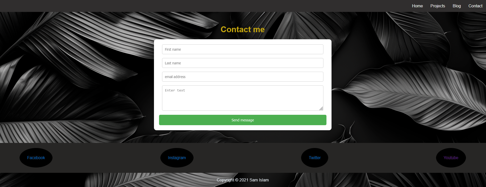

### Ipad
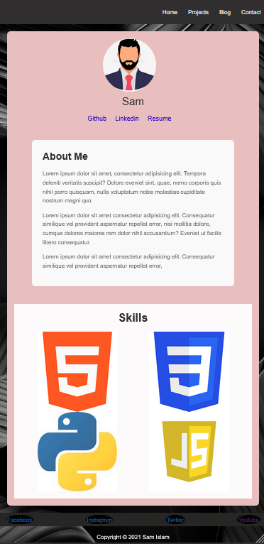

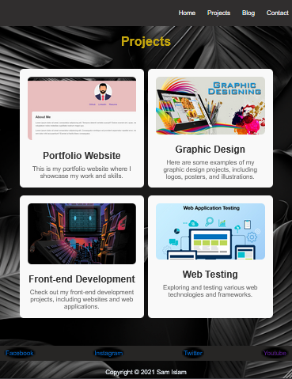

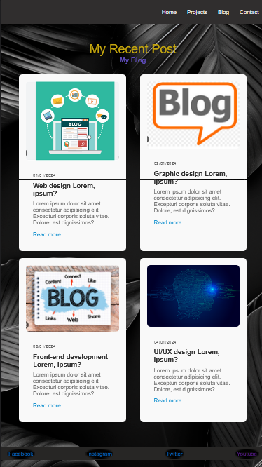

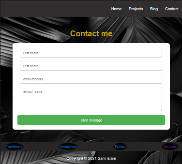
### Mobile
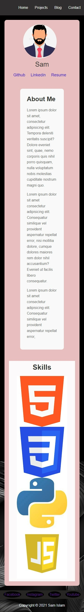
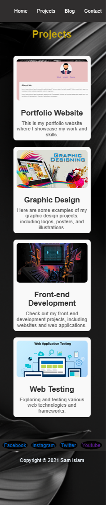
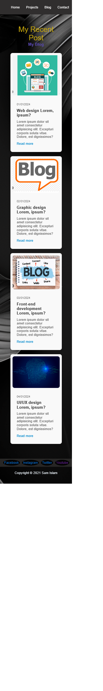
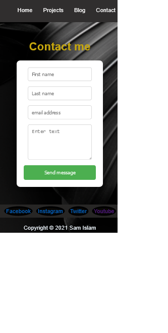