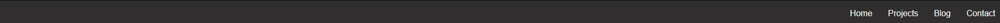
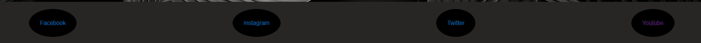
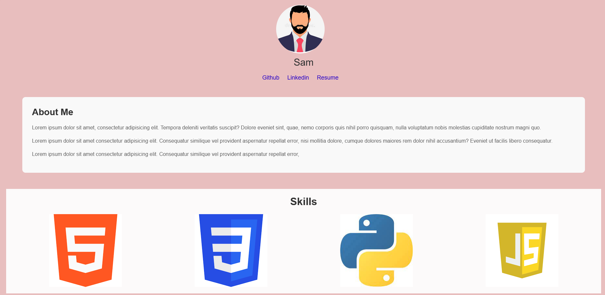
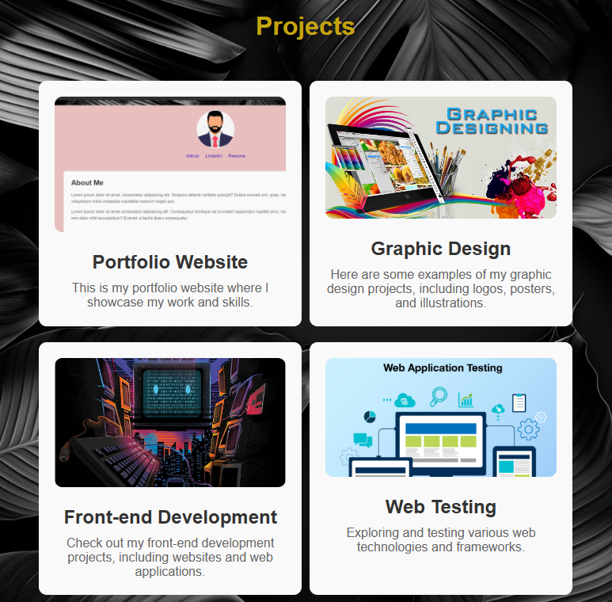
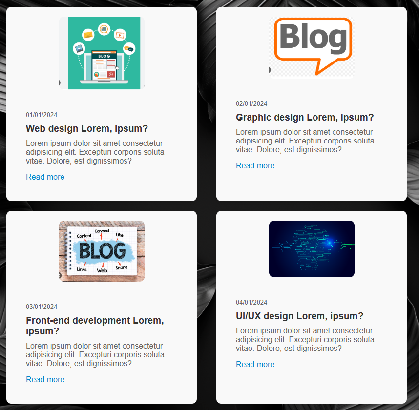

# Portfolio

## Git-hub repo 
Open [GitHub](https://github.com/Sam559I/Portfolio)
- 
## Purpose
 The portfolio website serves as a platform to exhibit my skills and attributes to both my peers and potential employers, while also functioning as a promotional tool to showcase the skills utilized in its creation to prospective clients. 

Through this website, I aim to present a  overview of my capabilities in a visually engaging and professional manner. It will feature sections such as an About Me page, Portfolio highlighting my work, Resume/CV section, blog and contact page.

## Functionality / features / Components
### Semantics
Used throughout html nav, main, div and foooter semantics to keep simple and easy to read.

### Reused Component/Feature
-  Responsive Nav bar this is linked to all pages of the portfolio, used flexbox for simple design and layout

- Resonsive Footer also linked throughout all pages of the portfolio. Links to social media outlets such as X(Twitter), Facebook, Instagram and youtube.

- Background image main used throughout the portfolio pages

### Home page
- graphical component avatar, icons for skills
- About text component simple description section with hover animations
- Links componet to social networks with mock resume (pdf attached)
- Skills section add graphics componet of skills, used flex to position added responsive hover

### Projects tab
- 4 graphical components
- Flexbox used for positioning
- hover feature included with tranistion time
- Link to project 1 to github repository for portfolio

### Blog tab
- 4 blog posts 
- Flexbox used for positioning
- Read more link 
- Text component each blog post dated, with small description
- Hover feature included with tranistion time

### Contact tab
- Contact form 
- responsive features added 

## Site map

Very simple design for website site map with easy features.
1. Home
- Quick access to Resume, LinkedIn, and GitHub profiles
- Introduction about myself
- Proficiency in programming highlighted in the Skills section
2. Projects
-Brief overview of 4 projects
3. Blog
- Simple design with 4 blog posts 
4. Contact
- Easy-to-use contact form

## Target audience
- Potential Employers: These could be recruiters, hiring managers, or HR professionals in my industry who are looking to assess my  skills, experience, and suitability for job opportunities.

- Peers and Colleagues: Other professionals in my field who may be interested in collaborating me, networking etc.

- Clients or Potential Clients: My portfolio website can serve as a showcase for potential clients who are considering hiring for my services

## Tech stack
1. HTML
2. CSS
3. git
4. github

## Wireframe
open [figma](https://www.figma.com/file/UGwWoGLfsIBdnsMtpguGNc/Untitled?type=whiteboard&node-id=0-1&t=TsFUi8y45Unmmbtd-0)

Final version slightly modified from original design for better functionality and overall better finished product. 

Through a series of modifications and adjustments, the emphasis has been placed on simplicity as a guiding principle. This deliberate choice ensures that the end product not only fulfills its intended objectives but also resonates more closely with my personal preferences and aesthetic sensibilities. 

By streamlining the design and eliminating unnecessary complexities, we have achieved a harmonious balance between form and function, resulting in a more intuitive and user-friendly solution.

## Screnshots
### Desktop

### Ipad

### Mobile

